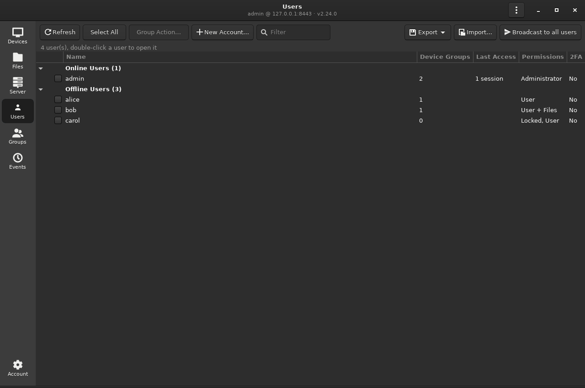
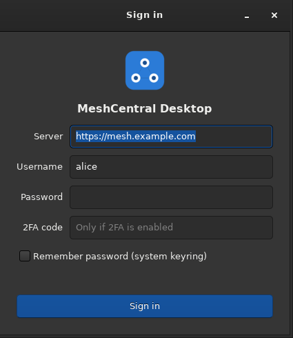
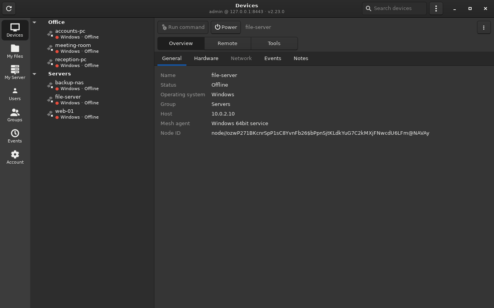
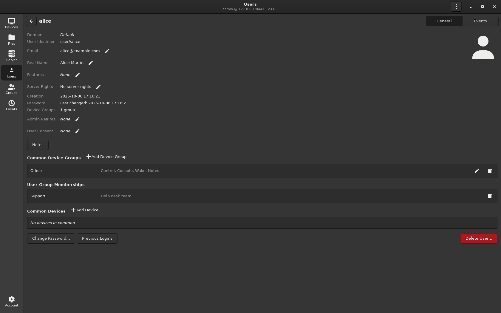
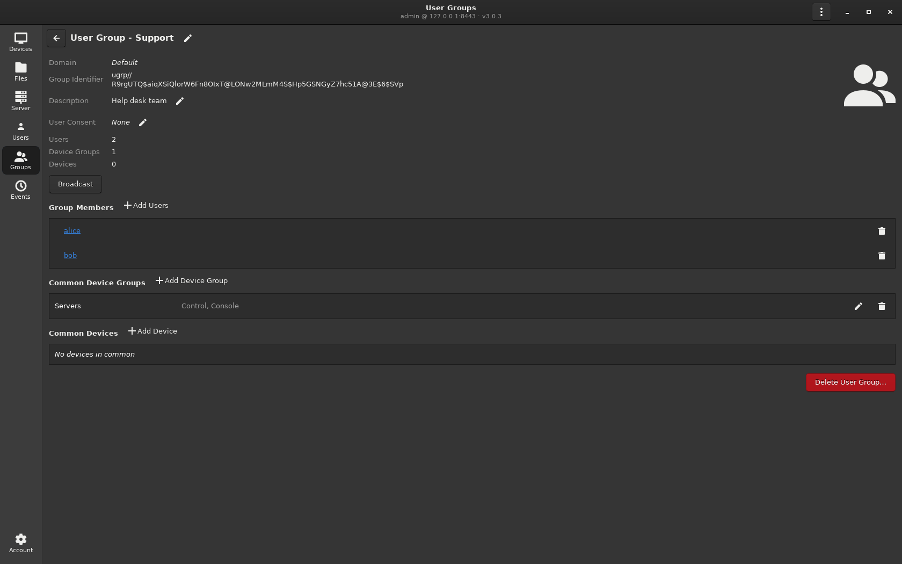
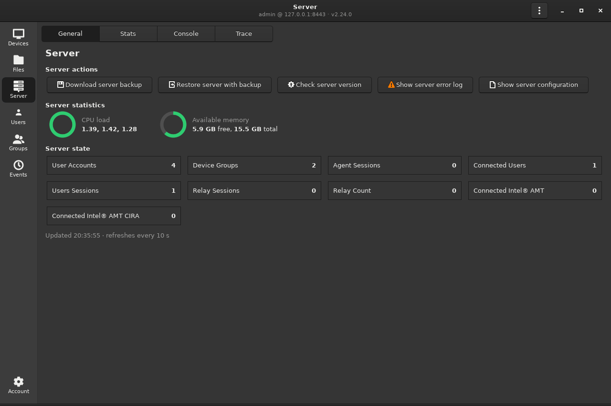
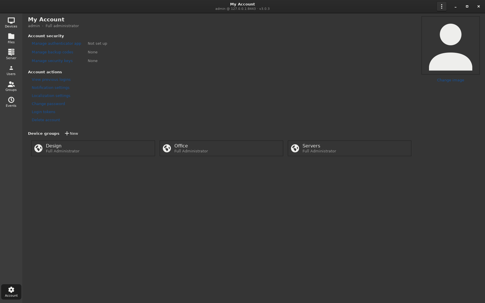

# MeshCentral Desktop

[](https://github.com/d-maggipinto/meshcentral-desktop/actions/workflows/ci.yml)
[](LICENSE)

A native Linux desktop client for [MeshCentral](https://github.com/Ylianst/MeshCentral). Manage your
devices, open remote desktops, terminals and file transfers, and administer the server from a GTK
application instead of a browser tab.

> **Unofficial project.** MeshCentral Desktop is an independent client made by CYVELION LTD. It is not
> affiliated with, endorsed by or supported by the MeshCentral project. It works with a standard,
> unmodified MeshCentral server.

- **Native interface** (GTK 3): navigation rail, device tree, grouped device pages, dark theme,
  desktop notifications.
- **Standard MeshCentral protocol**: the app talks to your existing server over the same control
  channel as the MeshCentral web interface. No server changes or plugins are needed.
- **Debian package** (`.deb`), developed and tested on Debian and Debian based distributions.

Current version: **2.23.0**, see the [changelog](CHANGELOG.md).



## Contents

- [Features](#features)
- [Screenshots](#screenshots)
- [Requirements](#requirements)
- [Install](#install)
- [Usage](#usage)
- [Security notes](#security-notes)
- [Known limitations](#known-limitations)
- [Building from source](#building-from-source)
- [Roadmap](#roadmap)
- [Documentation](#documentation)
- [Contributing](#contributing)
- [Relationship with MeshCentral](#relationship-with-meshcentral)
- [Credits](#credits)
- [License](#license)

## Features

### Devices
- Device tree grouped by device group, with online status, operating system and address, and a
  live search.
- Device pages in three groups: **Overview** (General, Hardware, Network, Events, Notes),
  **Remote** (Desktop, Terminal, Files) and **Tools** (Processes, Services, Agent Console).
- Actions: run commands and see their output, wake, sleep, restart, power off, message box, toast
  notification, rename, tags, notes, open in the web interface.
- Agents that restart or update are detected: the panels say so and the remote desktop reconnects
  on its own when the agent is back.

### Remote desktop
- Uses **MeshCentral's own desktop viewer**, embedded in the app and wrapped in native controls.
  The web sign-in page and the "connecting" steps are never shown, only the remote screen.
- Real fullscreen (**Ctrl+Alt+F**), fit to window, display picker for multi-monitor computers.
- **Send hotkeys**: Super, Alt+Tab, Alt+F4 and similar shortcuts go to the remote computer while its
  screen has focus.
- Correct characters on non-US keyboard layouts (AltGr combinations such as `@ # [ ] { } €`).
- Ctrl+Alt+Del (also on Linux targets), quality, speed, encoding and scaling controls.
- **Clipboard sync** in both directions, automatic, plus manual copy, paste and "type the
  clipboard as keystrokes".

### Terminal, files and tools
- Terminal (VTE): administrator or user shell, PowerShell on Windows.
- File manager for the device: browse, upload, download, rename, delete, new folder.
- Processes (end process), Services (start, stop, restart; fast `systemctl` listing on Linux),
  MeshAgent console.

### Server administration
- **My Server**: download a server backup, restore from a backup, check the version and update,
  error log, configuration, server warnings, live CPU, memory and server state, history charts
  (connections, memory, CPU, inbound and outbound traffic, CSV export), server console and server
  tracing.
- **My Files**: the server side file storage (personal folder and device group folders): upload,
  download, new folder, rename, delete, cut, copy and paste, edit small text files.
- **Users**, like the web interface's *My Users*: online and offline users with live session
  counts, device group count, last access, permissions, filter, Select All and **Group Action**
  (lock, unlock, validate email, delete). **New Account**, **Export** of the user list (CSV or JSON)
  and **Import** to create many accounts from a JSON or CSV file. Double-click a user to open its
  page: email, real name, features, server permissions, administrative realms, user consent,
  device group, user group and device permissions, notes, change password, previous logins,
  account image, events and delete.
- **Groups**, like *My User Groups*: users, device groups and devices counts, Select All, Group
  Action, **New Group** and **Duplicate Group**. Double-click a group to open its page: rename,
  description, user consent, broadcast, members (with name suggestions), device group and device
  permissions, delete.
- **Events**: the server event log.
- **My Account**: authenticator app (QR code), backup codes, security keys, previous logins,
  notification and language settings, change password, login tokens, delete account, device groups
  and account image.
- **Broadcast messages** to a user group or to all users; broadcasts sent from the web interface
  appear as notification cards.

### Respects permissions
The app reads the signed-in account's MeshCentral rights (per device group, per device, through user
groups, and account-wide restrictions) and only offers what the account may do. Features that are
not allowed are greyed out with an explanation instead of failing silently. See
[docs/PERMISSIONS.md](docs/PERMISSIONS.md).

## Screenshots

| | |
|---|---|
|  |  |
| Sign in | Devices |
|  |  |
| User page | User group page |
|  |  |
| My Server | My Account |

The screenshots were taken on a local test server with sample data.

## Requirements

- **Tested on Debian and Debian based distributions only**: Debian 12 or later, Ubuntu 22.04 or
  later, Kali Linux. Other distributions may work when the same libraries are installed, but they
  are not tested.
- Python 3.11 or later, GTK 3, WebKitGTK 4.1 (`gir1.2-webkit2-4.1`), VTE 2.91, libsecret.
- A MeshCentral server you can sign in to (user name, password and, if enabled, a two-factor code).

The package declares all dependencies, so `apt` installs them automatically.

## Install

Download the latest `.deb` and `SHA256SUMS` from the
[releases page](https://github.com/d-maggipinto/meshcentral-desktop/releases), then:

```bash
sha256sum -c --ignore-missing SHA256SUMS      # verify the download
sudo apt install ./meshcentral-desktop_2.23.0_all.deb
meshcentral-desktop
```

Every release also offers its source code as `.tar.gz` and `.zip`. Versions before 2.23.0 were
made before the project was published; they are available as archived builds for reference.

### Upgrade

The app runs as a single instance, so quit the running copy before installing a new version:

```bash
pkill -f meshcentral-desktop
sudo apt install ./meshcentral-desktop_<version>_all.deb
meshcentral-desktop
```

The version is shown in the window subtitle (`user @ server · vX.Y.Z`) and in *About*.

### Uninstall

```bash
sudo apt remove meshcentral-desktop
```

## Usage

1. Start **MeshCentral Desktop** from the application menu.
2. Enter the server address (for example `https://mesh.example.com`), your user name, your password
   and, if your account uses it, the two-factor code. The password can be remembered in the system
   keyring.
3. Choose a section on the left. In **Devices**, select a device to open its pages.

| Shortcut | Action |
|---|---|
| Ctrl+Alt+F | Toggle fullscreen remote desktop |
| Super+Esc (GNOME) | Give local shortcuts back while "Send hotkeys" is on |
| Ctrl+Shift+C / Ctrl+Shift+V | Copy and paste in the terminal |

The first time "Send hotkeys" is used on GNOME with Wayland, GNOME asks whether the app may inhibit
system shortcuts. Choose **Allow**.

## Security notes

- **Credentials**: the password is stored only if you tick *Remember password*, and then only in the
  system keyring (libsecret, GNOME Keyring). Settings are in `~/.config/meshcentral-desktop/config.json`
  and contain no secrets.
- **TLS**: connections to the server are verified against the system certificate store.
- **Embedded viewer sign-in**: the remote desktop uses MeshCentral's web viewer, so the app signs in
  to the web interface inside its own private WebKit profile (`~/.local/share/meshcentral-desktop/`).
- **My Files transfers and server backups** use a separate web session that is kept in memory only.
  The server configuration viewer shows `config.json`, which can contain secrets; it is only
  available to accounts with the server update right.
- **Clipboard sync agent patch**: on Linux agents, MeshCentral's own clipboard support is unreliable
  (it can lose the display of the logged-in user, and it discards pasted text after 20 seconds).
  When clipboard sync is on and your account has agent console rights, the app sends one small
  JavaScript patch to the connected agent through MeshCentral's agent console `eval` command. The
  patch lives only in the agent's memory and is gone after the agent restarts. It only changes how
  the agent finds the user's display and keeps the clipboard owner alive, and the command appears
  in the server event log like any console command. Turn **Clipboard sync** off in the desktop
  toolbar to avoid it. Details: [docs/REMOTE_DESKTOP.md](docs/REMOTE_DESKTOP.md).
- The server enforces all MeshCentral permissions; the app never tries to work around them.

Please report security problems privately, see [SECURITY.md](SECURITY.md).

## Known limitations

- The remote desktop needs a graphical session on the target computer; headless machines cannot be
  viewed.
- Linux agents only share the **X11** clipboard; applications that run only on Wayland on the remote
  side do not see it.
- Large file downloads from *My Files* need a web sign-in; accounts that must enter a two-factor code
  at every web sign-in are limited to files under 200 KB there.
- Security keys (WebAuthn) can be listed and removed but not registered, because registering needs
  a web browser.
- *Previous logins* lists only sign-ins to the web interface; the server does not record app
  sign-ins there.
- Only tested on Debian based distributions.

## Building from source

```bash
git clone https://github.com/d-maggipinto/meshcentral-desktop.git
cd meshcentral-desktop
scripts/build-deb.sh              # writes dist/meshcentral-desktop_<version>_all.deb
```

Run from the source tree without installing:

```bash
python3 pkg/usr/share/meshcentral-desktop/main.py
```

Run the unit tests:

```bash
python3 -m unittest discover -s tests/unit -v
```

Build steps, the local test server, the rig tests and the release checklist are in
[docs/DEVELOPMENT.md](docs/DEVELOPMENT.md).

## Roadmap

Planned next: the full remote desktop toolbar (guest sharing, refresh, session recording,
screenshots, wallpaper toggle, open a web address, notifications and chat on the remote computer),
Windows and macOS apps, testing with Windows and macOS remote computers, a refreshed interface and
security improvements such as signed releases. See [ROADMAP.md](ROADMAP.md).

## Documentation

| Document | Content |
|---|---|
| [docs/ARCHITECTURE.md](docs/ARCHITECTURE.md) | how the code is organised |
| [docs/PROTOCOL.md](docs/PROTOCOL.md) | MeshCentral protocol notes, verified against a live server |
| [docs/REMOTE_DESKTOP.md](docs/REMOTE_DESKTOP.md) | remote desktop, keyboard and clipboard internals |
| [docs/PERMISSIONS.md](docs/PERMISSIONS.md) | how MeshCentral rights map to app features |
| [docs/DEVELOPMENT.md](docs/DEVELOPMENT.md) | build, tests and release |
| [tests/rig/README.md](tests/rig/README.md) | rig tests against a local MeshCentral server |
| [ROADMAP.md](ROADMAP.md) | planned features |
| [CHANGELOG.md](CHANGELOG.md) | release history |

## Contributing

Bug reports, ideas and pull requests are welcome. Please read [CONTRIBUTING.md](CONTRIBUTING.md)
first.

## Relationship with MeshCentral

MeshCentral Desktop is an independent client application for MeshCentral. It is not a fork or a
distribution of the MeshCentral server.

The application communicates with standard MeshCentral servers using their existing protocols and
interfaces. It does not require any modification to the MeshCentral server. The remote desktop
view displays the viewer that your own MeshCentral server provides, and a few parts of this client
follow the MeshCentral source code; these are listed in [NOTICE](NOTICE).

MeshCentral is developed by Ylian Saint-Hilaire and contributors and is licensed under the Apache
License, Version 2.0: https://github.com/Ylianst/MeshCentral

MeshCentral Desktop is developed independently by CYVELION LTD.

## Credits

- **Author**: Denis Maggipinto ([@d-maggipinto](https://github.com/d-maggipinto)), [CYVELION LTD](mailto:d.maggipinto@cyvelion.co.uk).
- **Developed with** [Claude Code](https://claude.com/claude-code) by Anthropic.
- **MeshCentral** by [Ylian Saint-Hilaire](https://github.com/Ylianst) and the MeshCentral
  contributors ([meshcentral.com](https://meshcentral.com),
  [GitHub](https://github.com/Ylianst/MeshCentral), Apache License 2.0), the server software this
  client works with. See [Relationship with MeshCentral](#relationship-with-meshcentral) and
  [NOTICE](NOTICE).

## License

Copyright 2026 CYVELION LTD. Licensed under the [Apache License, Version 2.0](LICENSE). See [NOTICE](NOTICE)
for attributions.
